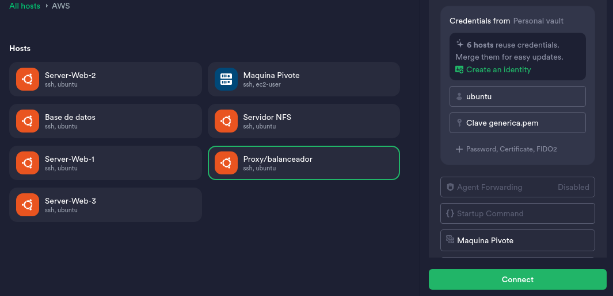

# Despliegue de CMS Wordpress en AWS con Alta Disponibilidad y Escalabilidad

Este proyecto tiene como objetivo desplegar un **CMS Wordpress** en una infraestructura de **AWS** diseñada para garantizar alta disponibilidad, escalabilidad y seguridad. La solución se basa en una arquitectura de **tres capas** (Balanceador de Carga, Backend y Base de Datos), con acceso público limitado.

# Indice

1. [Infraestructura de AWS](#Infraestructura-de-aws)
2. [Configuración inicial AWS](#configuración-inicial-aws)
    1. [Creación de la VPC y las subredes](#creación-de-la-vpc-y-las-subredes)
    2. [Puerta de enlace de internet](#puerta-de-enlace-de-internet)
    3. [Tablas de enrutamiento](#tablas-de-enrutamiento)
    4. [Obtención de las IP Elásticas](#obtención-de-las-ip-elásticas)
    5. [Grupos de seguridad](#grupos-de-seguridad)
    6. [Creación de las instancias](#creación-de-las-instancias)
3. [Configuración de SSH en el cliente](#configuración-de-ssh-en-el-cliente)
4. [Configuración de los servidores Ubuntu](#configuración-de-los-servidores-ubuntu)
    1. [Servidor “Base de datos”](#servidor-base-de-datos)
    2. [Servidor “NFS”](#servidor-nfs)
    3. [Servidores “Web”](#servidores-web)
    4. [Servidor Proxy/Balanceador](#servidor-proxybalanceador)
5. [Securización de AWS](#securización-de-aws)
    1. [Configuración de las redes privadas](#configuración-de-las-redes-privadas)
    2. [Reglas para los grupos de seguridad](#reglas-para-los-grupos-de-seguridad)
    3. [Creación de ACLs para cada subred](#creación-de-acls-para-cada-subred)
6. [Conclusión](#conclusión)


# 1. Infraestructura de AWS

En este proyecto contaremos con la siguiente estructura de las máquinas que crearemos en AWS:

- Capa 1 (Publica)
    - Maquina Proxy/Balanceador
    - Maquina Pivote (esta máquina tiene conexión a internet y acceso a las instacias de la redes privadas)
- Capa 2 (Privada 1)
    - Servidor Web 1
    - Servidor Web 2
    - Servidor NFS
- Capa 3 (Privada 2)
    - Servidor Base de datos

# 2. Configuración inicial de AWS

En este apartado configuraremos de manera **estructurada** los recursos base necesarios para el despliegue de la infraestructura en AWS. Este proceso incluye los siguientes pasos clave:

GS-NFC

## VPC y las subredes

Lo primero que tendremos que crear es una VPC, la cual tendrá una dirección de red (192.168.10.0/24). En mi caso se llamará “*proyecto*”

Tras esto, crearemos 4 subredes, las cuales tendrán cada una una dirección de red con su prefijo de red o **CIDR.**

| Nombre de la Subred | Dirección de Red |
| --- | --- |
| Subred-proxy/internet | 192.168.10.0/26 |
| Subred-Base-de-datos | 192.168.10.128/26 |
| Subred-Server-Web/NFS | 192.168.10.64/26 |
| Subred-pivote | 192.168.10.192/28 |

## Puerta de enlace de internet

Lo primero que haremos será crear una puertas de enlace de internet, que la utilizaremos para permitir que la VPC tenga acceso a internet. 

Tras esto, la asociaremos nuestra **GW-Internet a la VPC**, lo que debería de quedar algo así:

| Nombre del Gateway | ID del Gateway | Estado | VPC Asociada | Cuenta de AWS |
| --- | --- | --- | --- | --- |
| GW-internet | igw-0ea5362b5c22b56dc | Attached | vpc-0db727800ae8353c5 (proyecto) |  |

## Tablas de enrutamiento

Aquí, tendremos que crear 3 tablas, asociándolas a nuestra VPC.

Después, tendremos que asociar cada tabla de enrutamiento con una subred, en este caso sería así:

| Tabla de enrutamiento | Subred a asociar |
| --- | --- |
| Tabla Publica | Subred-proxy/internet |
| Tabla Privada | Subred-Base-de-datos—Subred-Server-Web/NFS |
| Tabla Pivote | Subred-pivote |

Para terminar de configurar las tablas de enrutamiento, tendremos que indicar en la configuración de las rutas (de cada tabla),  que las dirección 0.0.0.0/0 tenga como destino las GW-Internet (para las redes privada será algo temporal).

Con esto, hemos conseguido que nuestras maquinas tengas acceso entre las subredes de la VPC y que puedan tener conexión a internet.

## Obtención de las IP Elásticas

Las IP Eláticas las utilizaremos para permitir que una instancia o varias pueda tener acceso exclusivo a esas IPs publicas fijas (que no varían).

Para este proyecto necesitaremos dos:

- IP Wordpress: se utilizará para las conexiones HTTPS con el exterior desde la instancia del Proxy/Balanceador.
- IP Pivote: esta la utilizaremos para las conexiones SSH que provienen del exterior.

## Grupos de seguridad

Crearemos varios grupos de seguridad, que en futuros pasos los configuraremos para restringir el acceso de ciertas conexiones a las instancias que asociemos el grupos de seguridad.

Por lo que tendremos que crear los siguientes grupos:

- GS-Proxy/Balanceador
- GS-Mysql
- GS-NFS
- GS-Web: este servirá para las instancias Webs.
- GS-Pivote

A estos por ahora, no le estableceremos ninguna regla dejando que entren y salga cualquier tipo de conexión. 

## Creación de las instancias

Las instancias será donde nosotros tengamos el sistema operativo, con nuestros servicios.

Para crear estos, tendremos que tener en cuanta los siguientes aspectos:

- En todas las maquinas tendremos las mismas claves de inicio de sesión, por lo que durante la primera de la instalación de una instancia, las crearemos. Se descargará un archivo .PEM que utilizaremos después.
- Cada maquina, tiene que ir asociada a la VPC y subred correspondiente.
- También tendrán que ir con su grupo de seguridad.
- Las máquinas que estén en las redes “privadas” (aunque todavía no sean privadas), para que tengan acceso a internet necesitaremos habilitar la **Asignación de IPs públicas automáticas,** ya que si esta no tendrán acceso a internet.
- Las maquinas que tendrán una IP Elastica (pivote y proxy/balanceador), no deben de habilitar la opción anterior, pero si tendremos que **asignare después una IP Elástica a la instancia**.
- Tendremos que **fijar una IP privada para las máquinas**, que se hace en el apartado de “Configuración de red” — “Configuración de red avanzada” — “Ip principal”. La IP que asignemos tiene que estar dentro del rango de la subred y no puede ser una de las 5 primeras.

Estas son las instancias que he creado:

| Name | Subred | Dirección IP privada | IP Elástica | Imagen de la instancia |
| --- | --- | --- | --- | --- |
| Base de datos | Subred-Base-de-datos | 192.168.10.133 |  | Ubuntu 24 |
| Máquina Pivote | Subred-pivote | 192.168.10.197 | 3.231.13.161 | Amazon Linux |
| Proxy/Balanceador | Subred-proxy/internet | 192.168.10.6 | 98.83.199.190 | Ubuntu 24 |
| Server-Web-1 | Subred-Server-Web/NFS | 192.168.10.68 |  | Ubuntu 24 |
| Server-Web-2 | Subred-Server-Web/NFS | 192.168.10.69 |  | Ubuntu 24 |
| Servidor NFS | Subred-Server-Web/NFS | 192.168.10.71 |  | Ubuntu 24 |

Con esta configuración hecha, ya podremos realizar el siguiente paso.

# 3. Configuración de SSH en el cliente

Para conectarnos con las instancias que tenemos, vamos a utilizar la maquina pivote como un intermediario de la conexión. Este nos proporcionará un acceso seguro a las conexiones SSH de nuestras instancias a través de la red privada.

La imagen de la máquina Amazon Linux, permite por defecto el paso de este tipo de conexiones SSH, por lo que no tendremos que hacer ninguna configuración en esta.

Para poder conectarnos a las instancias a traves de terminal, podemos usa el siguiente comando:

```bash
ssh -i clave.pem -J usuario_pivote@IP_Piv usuario_interno@servidor-interno
```

También podemos conectarnos desde Termius, la cual podemos indicar el “Jump Hosts” (El intermediario), permitiendo conectarnos de manera rápida a las terminas de cada instancia.



# 4. Configuración de los servidores Ubuntu

Ahora, realizaremos todos los pasos necesarios para montar el CMS de Wordpress en los diferentes servidores de AWS. Para ello, tenemos que tener un nombre de dominio.

Los scripts habrá que ejecutarlos en el mismo orden con el que los vaya explicando, para evitar tener errores.

## Servidor “Base de datos”

Este es el servidor que almacenará todas las bases de datos. 

Para configurar este, daremos los permisos necesarios al archivo `Script-Server-BD.sh` y lo ejecutaremos. Antes de ejecutarlo tendremos que tener en cuenta:

- $IP_MAS=es el rango de IPs de los servidores Web a los que permitirá la base de datos conectarse al usuario definido.
- $db_passwd=es la contraseña que se le establecerá al root de la base de datos.
- $DB_USER=es el usuario utilizado para la base de datos Wordpress
- $DB_PASS=contraseña del usuario para la base de datos Wordpress

Los últimos dos valores los tendremos que tener en cuenta durante la instalación gráfica de Wordpress.

## Servidor “NFS”

El servidor NFS se encargará de almacenar y compartir la carpeta donde el CMS de Wordpress se instalar, permitiendo tener varios servidores Web accediendo a los mismo archivos. 

En este, tenemos que tener en cuenta que al final del archivo hay varias lineas que habrá que comentar, ya que son para archivo `wp-config.php` , que se generará solo durante la instalación gráfica del Wordpress. Estas lineas, las ejecutaremos cuando toda la configuración de lo servidores este terminada.

El Script del servidor NFS es `Script-Server-NFS.sh`.

## Servidores “Web”

Los servidores web serán los que alojen la página web a través de Apache. Se instalará Apache y las dependencias necesarias para permitir el uso de PHP y la conexión con la base de datos. También se instalará el cliente NFS para mantener sincronizadas las carpetas donde se encuentra WordPress. 

Los scripts deberán instalarse en cada uno de sus servidores correspondientes. Una vez instalados, podremos comprobar que están funcionando correctamente a través de la IP pública dinámica asignada.

Los scripts son [`Script-Server-Web1.sh](http://Script-Server-Web1.sh)`  y  `[Script-Server-Web2.sh](http://Script-Server-Web1.sh)` .

## Servidor Proxy/Balanceador

Este es el script con el que hay que tener más cuidado, ya que puede fallar durante la creación del certificado. 

Además, debemos comprobar que el nombre de dominio esté apuntando a la IP Elástica del servidor Proxy/Balanceador.

Una vez revisado y adaptado el script a tu configuración, ya podremos ejecutar `Script-Balancer-proxy.sh`.

Por último, tendremos que ejecutar los comandos que mencionamos anteriormente en el servidor NFS para evitar problemas con el CSS de WordPress, ya que el sitio está funcionando a través de un Proxy/Balanceador.

# 5.0 Securización de AWS

Para cumplir todos los requisitos para este proyecto, tendremos que eliminar cierta configuración que hicimos anteriormente, pero siempre y cuando nos halla funcionado todos los pasos anteriores. Para realizar la siguiente configuración, lo recomendable será ir poco a poco comprobando si las modificaciones que realizamos no perjudican al Wordpress o al SSH.

## Configuración de las redes privadas

Anteriormente, habilitamos la “**Asignación de IPs públicas automáticas”** para algunas instancias. Esta configuración hora ya no es necesaria, ya que estas máquina no necesitarán tener acceso a internet. Son las siguientes:

- Server-Web-1
- Server-Web-2
- Servidor-NFS
- Servidor-Base-de-datos

Para eliminar la “**Asignación de IPs públicas automáticas**”, tendremos que hacer lo siguiente:

1. Seleccionar la Instancia a modificar
2. Acciones
3. Redes
4. Administrar direcciones IP
5. Desplegamos la interfaz y desmarcamos la opción anteriormente dicha.

Ahora, tendremos modificar las **subredes “privadas” en subredes realmente privadas** (sin conexión a internet).  Para esto, tendremos que **eliminar** en la tabla de enrutamiento privada, **la ruta 0.0.0.0/0 a la GW-internet.**

Una vez realizado, el mapa de recursos de la VPC nos debe de quedar así: 


## Reglas para los grupos de seguridad

Ahora, en este apartado lo que haremos será modificar las **reglas de entradas** de los grupos de seguridad de cada instancia. Esto evitará cualquier conexión que no este permitida a nivel de instancia.

Tendremos que hacer la siguiente configuración: 

**1. Grupos de seguridad del Balanceador:**

- Permitir SSH desde la máquina Pivote.
- Permitir HTTP desde cualquier origen.
- Permitir HTTPS desde cualquier origen.

| **Tipo** | **Protocolo** | **Intervalo de Puertos** | **Origen** |
| --- | --- | --- | --- |
| SSH | TCP | 22 | 192.168.10.192/26 |
| HTTP | TCP | 80 | 0.0.0.0/0 |
| HTTPS | TCP | 443 | 0.0.0.0/0 |

**2. Grupos de seguridad de los Servidores Web:**

- Permitir tráfico HTTP que proviene del Balanceador.
- Permitir tráfico SSH desde la máquina Pivote.
- Permitir tráfico NFS desde el servidor NFS.
- Permitir tráfico MSSQL (puerto 1433) que proviene de la Base de Datos.

| **Tipo** | **Protocolo** | **Intervalo de Puertos** | **Origen** |
| --- | --- | --- | --- |
| HTTP | TCP | 80 | 192.168.10.0/26 |
| SSH | TCP | 22 | 192.168.10.192/26 |
| NFS | TCP | 2049 | 192.168.10.64/26 |
| MSSQL | TCP | 1433 | 192.168.10.128/26 |

**3. Grupos de seguridad del Servidor NFS:**

- Permitir tráfico SSH desde la máquina Pivote.
- Permitir tráfico NFS desde las máquinas de su misma subred.

| **Tipo** | **Protocolo** | **Intervalo de Puertos** | **Origen** |
| --- | --- | --- | --- |
| NFS | TCP | 2049 | 192.168.10.64/26 |
| SSH | TCP | 22 | 192.168.10.192/26 |

**4. Grupos de seguridad del Servidor de Base de Datos:**

- Permitir tráfico SSH desde la máquina Pivote.
- Permitir tráfico MySQL (puerto 3306) desde la subred de los Servidores Web.

| **Tipo** | **Protocolo** | **Intervalo de Puertos** | **Origen** |
| --- | --- | --- | --- |
| SSH | TCP | 22 | 192.168.10.192/28 |
| MYSQL/Aurora | TCP | 3306 | 192.168.10.64/26 |

---

**5. Grupos de seguridad de la máquina Pivote:**

- Permitir tráfico SSH desde cualquier origen.

| **Tipo** | **Protocolo** | **Intervalo de Puertos** | **Origen** |
| --- | --- | --- | --- |
| SSH | TCP | 22 | 0.0.0.0/0 |

## Creación de ACLs para cada subred

Ahora, lo que haremos será establecer reglas a nivel de subred. En este caso, solo se permitirá las reglas que tengamos añadidas, ninguna más. 

A las ACLs, hay que añadirle dependiendo de la “subred/tipo de regla”, tendremos que permitir unos puerto extra que son los **puertos efímeros (32768 - 60999) ,** ya que algunos protocolos utilizan estos puertos para conexiones entre clientes-servidor.

Estas son las ACLs que he aplicado a las subredes:

### **ACLs de Entrada**

**1. ACL de la subred (Pivote):**

- Regla 1: Permitir el tráfico SSH desde cualquier lado.
- Regla 2: Permitir el tráfico de los puertos efímeros (32768 - 60999) desde cualquier lado.

**2. ACL de la subred (Proxy/Balanceador):**

- Regla 1: Permitir SSH desde la máquina Pivote.
- Regla 2: Permitir HTTP desde cualquier lado.
- Regla 3: Permitir HTTPS desde cualquier lado.
- Regla 4: Permitir el tráfico de los puertos efímeros (32768 - 60999) desde cualquier lado.

**3. ACL de la subred (Webs/NFS):**

- Regla 1: Permitir HTTP desde el servidor Balanceador.
- Regla 2: Permitir SSH desde la máquina Pivote.
- Regla 3: Permitir MSSQL (puerto 1433) desde la Base de Datos.
- Regla 4: Permitir el tráfico de los puertos efímeros (32768 - 60999) desde la subred del servidor de Base de Datos.

**4. ACL de la subred (Base de Datos):**

- Regla 1: Permitir SSH desde la máquina Pivote.
- Regla 2: Permitir MySQL (puerto 3306) desde toda la subred de los Servidores Web.
- Regla 3: Permitir el tráfico de los puertos efímeros (32768 - 60999) desde la subred de los Servidores Web.

### ACLs de Salida

**1. ACL de la subred (Pivote):**

- Regla 1: Permitir el tráfico SSH hacia cualquier lado.
- Regla 2: Permitir el tráfico de los puertos efímeros (32768 - 60999) hacia cualquier lado.

**2. ACL de la subred (Proxy/Balanceador):**

- Regla 1: Permitir HTTP hacia cualquier lado.
- Regla 2: Permitir HTTPS hacia cualquier lado.
- Regla 3: Permitir el tráfico de los puertos efímeros (32768 - 60999) hacia cualquier lado.

**3. ACL de la subred (Webs/NFS):**

- Regla 1: Permitir HTTP hacia la máquina Proxy/Balanceador.
- Regla 2: Permitir MSSQL (puerto 1433) hacia la Base de Datos.
- Regla 3: Permitir el tráfico de los puertos efímeros (32768 - 60999) hacia cualquier lado.

**4. ACL de la subred (Base de Datos):**

- Regla 1: Permitir MSSQL (puerto 1433) hacia los Servidores Web.
- Regla 2: Permitir el tráfico de los puertos efímeros (32768 - 60999) hacia cualquier lado.

# 6.0 Conclusión

Este proyecto implementa un despliegue de CMS Wordpress en AWS, utilizando una arquitectura de tres capas que asegura alta disponibilidad, escalabilidad y seguridad. Con un enfoque en la configuración estructurada, la securización de redes y la automatización mediante scripts, esta solución ofrece un entorno robusto y eficiente para gestionar aplicaciones web. La infraestructura creada está optimizada para permitir conexiones seguras y un rendimiento confiable, cumpliendo con las mejores prácticas de diseño en la nube.
